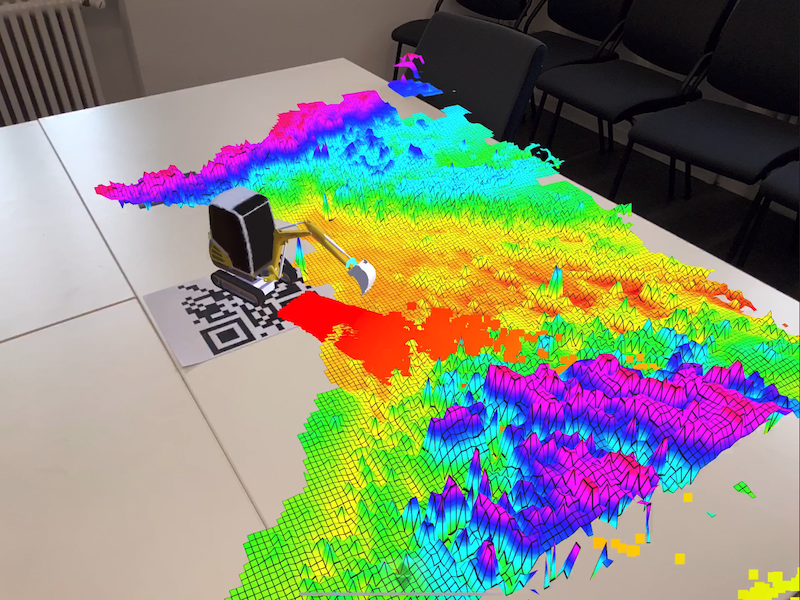
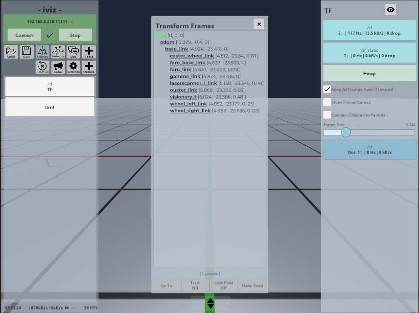
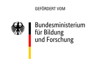

# Welcome to iviz!

**iviz** is a mobile 3D visualization app for ROS based on the Unity Engine.
You can use it to display 3D information about topics, navigate your virtual environment, or watch your robot in Augmented Reality.

iviz has been designed primarily for use in **mobile devices** (iOS/Android smartphones and tablets), but can also be used in a normal PC if you don't mind the big buttons.

## 1. Installation

To run iviz, you need the following:
* Unity 2019.4 LTS editor on either Windows, Linux, or macOS
* An iOS or Android device (optional)

The iviz project has no external dependencies (all required libraries are included), so installing it is just a matter of cloning the repository, launching Unity, and selecting the scene at 'Scenes/UI AR'.

## 2. Getting Started

Here are some instructions on how to get started:

* Start Unity 2019.4, and open the project on the iviz folder. Make sure that the scene **Scenes/UI AR** is active. Press Play.
* On the panel at the top-left, right underneath the "- iviz -" label, tap on the address with the arrow at the end.

* You should now see the **Connection Dialog**.
  - Type in the URL of the master, i.e., where roscore is running. This is the content usually stored in the environment variable _ROS_MASTER_URI_.
    * The arrow icon will show you previously used masters.
  - Type in the URL of your device, or leave the default. The URL should have the form http://_hostname_:port/
    * The hostname is the content usually stored in _ROS_HOSTNAME_ or _ROS_IP_. 
    * The port (7613) can be set to anything, just make sure it's not being used by another application.
    * The hostname and port should be accessible to the ROS nodes that you want to contact. This is important for devices that are in multiple networks.
    * Note that the hostname and port will be sent 'as is' to other ROS nodes. For example, if you use something like http://localhost:7613, other computers will try to connect to themselves instead of you.
    * The arrow icon will show a list of example URLs based on the addresses of your device. 
  - Finally, type in your id, or leave the default. This is the name of your ROS node. It can be anything, but make sure it is unique in your network.
* Once the data is correct, tap on the _Connect_ button. The application will now try to connect to the ROS master, and keep retrying if it does not work. Tap _Stop_ to cancel the operation. 
* Once you have connected, the top-left panel should become green. You can now add modules such as topic listeners, robots, watch the TF frames, and so on.

## 3. Navigation

To move around:
* On a PC: Hold down the right mouse button and move the mouse to rotate the camera. While holding the right button down, press W-A-S-D to translate the camera. (This is the same behaviour as in Unity)
* On a mobile device: Tap with one finger and drag to rotate the camera. Tap with two fingers and move to translate the camera. Pinch to zoom in and out.

## 4. Working with Transform Frames

TBW...

## 5. Working with Robots

TBW...

## 6. Working with Augmented Reality
TBW...

## 7. Credits

